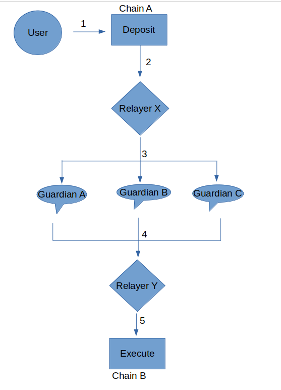

# NFT Bridge Project

This repository contains Core contracts of NFT Bridge.

Try running some of the following tasks:

```shell
npm install
npx hardhat test
```

# Deployments

To start the deployment, set up Hardhat.config.ts as per requirements. Default config is set for BSC testnet. 
First deploy the token contract on the chain, then deploy MinterBurnerPauser. After that deploy the core contracts, and fetch the address of core contract. Enter the address in deploy_bridge.ts and finally deploy bridge on the chain. 

''' shell
hardhat run scripts/deploy_token.ts --network testnet
hardhat run scripts/deploy_minter.ts --network testnet
hardhat run scripts/deploy_core.ts --network testnet
hardhat run scripts/deploy_bridge.ts --network testnet
'''

# Bridge Process Overview



1. User starts by running the Deposit function of Bridge Contract. This function takes three parameters: Resouce ID, Destination domain ID and data created by hashing tokenAmountOrID,len(recipientAddress) and recipientAddress together.

2. After successful run of Deposit function, it will emit a event called "LogMessagePublished", which contains address of the sender, Sequence, Nonce, Payload and Consistency Level. 

3. Relayer will fetch this LogMessagePublished event and decode the data within. VAA Struct will be created which holds version, timestamp, nonce, emitterChainId, emitterAddress, Sequence, ConsistencyLevel, Payload and array of Signatures.

4. Guardians will gossip within each other via a P2P communication network and validate the VAA by signing it.

5. Opon receiving signatures of more than 2/3 Guardians, one of the guardian will fire "Execute" Function of Bridge Bridge Contract on Chain B with Bytes encoded data of VAA. This action results in minting the token for user in receiver chain with token data provided in payload of VAA.

6. Relayer X and Y can be the same entity. Chain A denotes the sender Chain and Chain B denotes for Receiver Chain.
